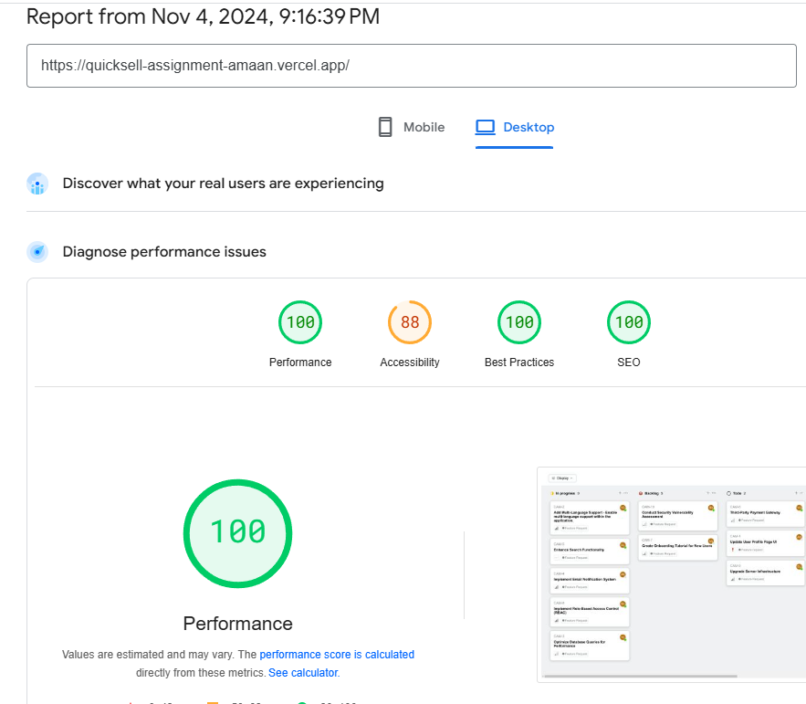
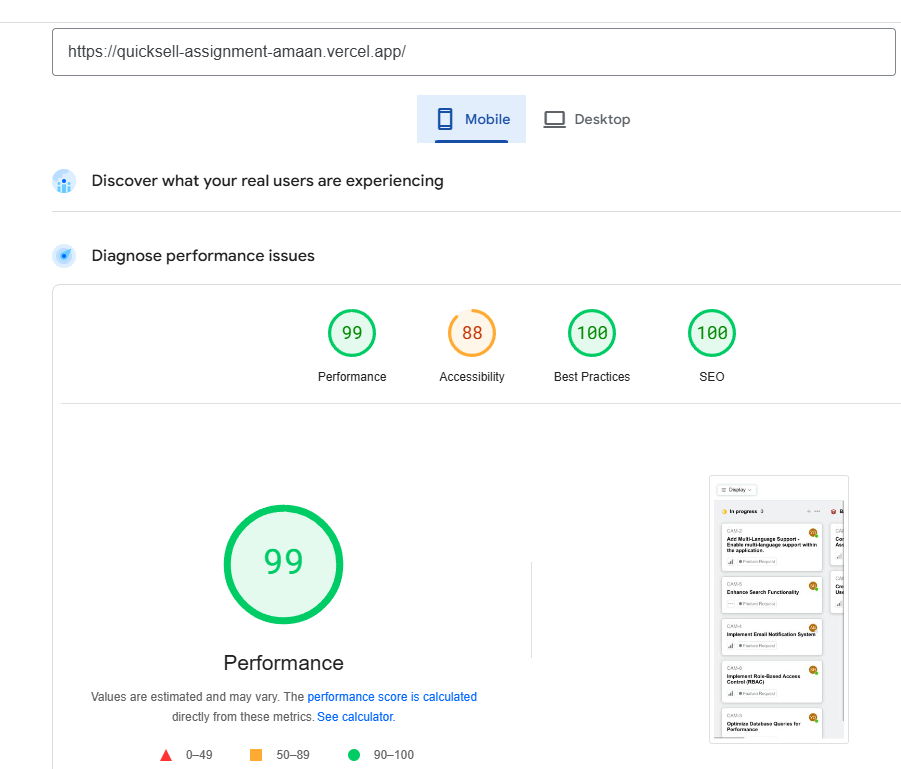

A responsive, high-performance Kanban board built with React, featuring dynamic grouping, sorting, and a dark mode toggle. The board fetches data from an API, displays tickets with customizable views, and persists user preferences across sessions.

## Table of Contents
- [Features](#features)
- [Technologies Used](#technologies-used)
- [Usage](#usage)
- [Screenshots](#screenshots)

## Features

- **Dynamic Grouping**: Group tickets by status, user, or priority.
- **Custom Sorting**: Sort tickets within groups by priority or title.
- **Dark Mode Toggle**: Switch between light and dark themes for better visual comfort.
- **Responsive Design**: Optimized for desktop, tablet, and mobile devices.
- **Local Storage Persistence**: Saves user preferences (grouping, sorting, and theme) across sessions.
- **API Integration**: Fetches ticket data from an external API for real-time updates.

## Technologies Used

- **React** - for building the user interface.
- **CSS** - for custom styling and responsive design.
- **localStorage** - to save user preferences.
- **Fetch API** - for fetching data from the backend API.

## Usage

1. **Grouping and Sorting**:
   - Use the dropdown menus to group tickets by status, user, or priority.
   - Sort tickets within each group by priority or title.

2. **Dark Mode**:
   - Toggle between light and dark themes using the Dark Mode switch in the controls section.

3. **Persistence**:
   - Your preferences for grouping, sorting, and theme will be saved automatically and applied when you revisit the app.

## Screenshots

